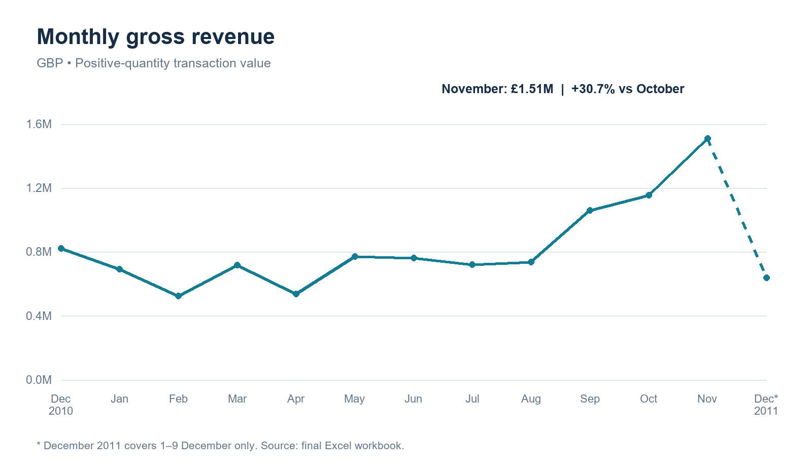
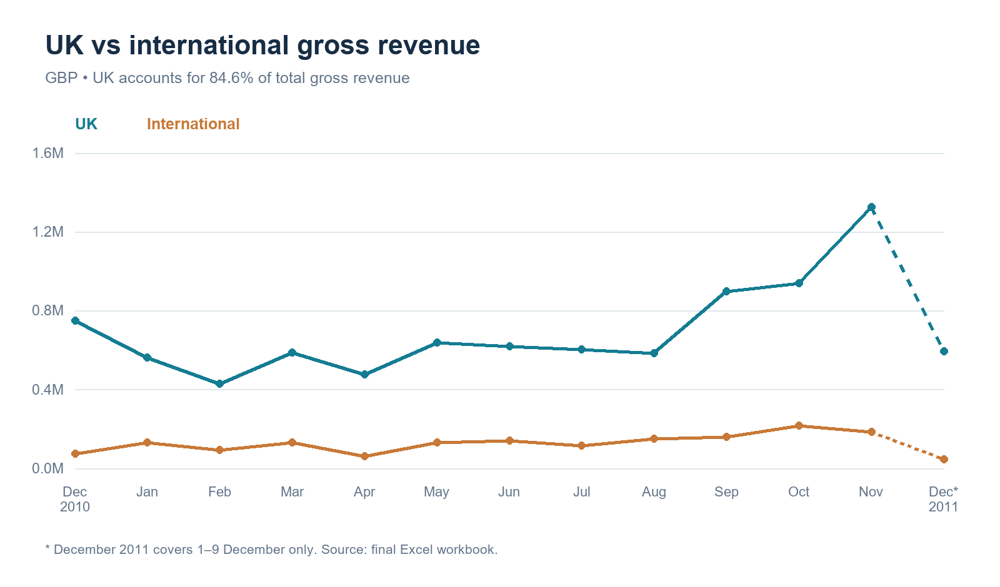
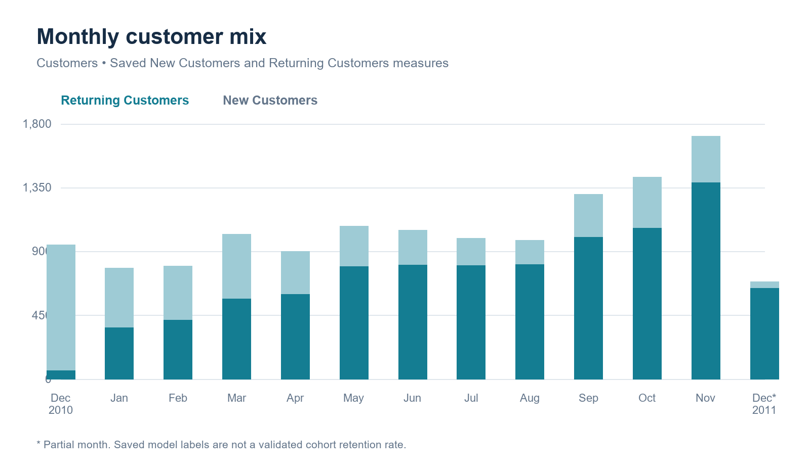
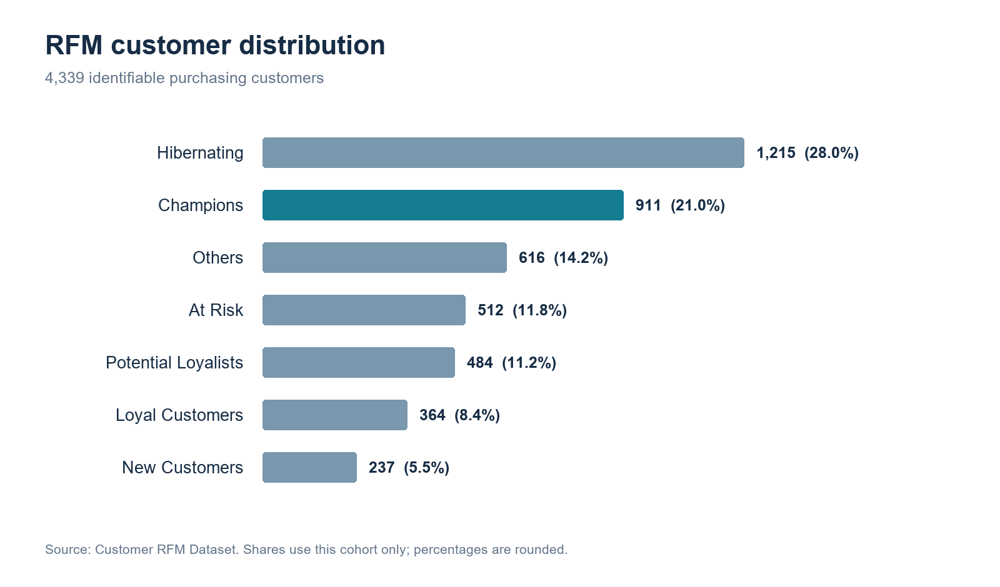
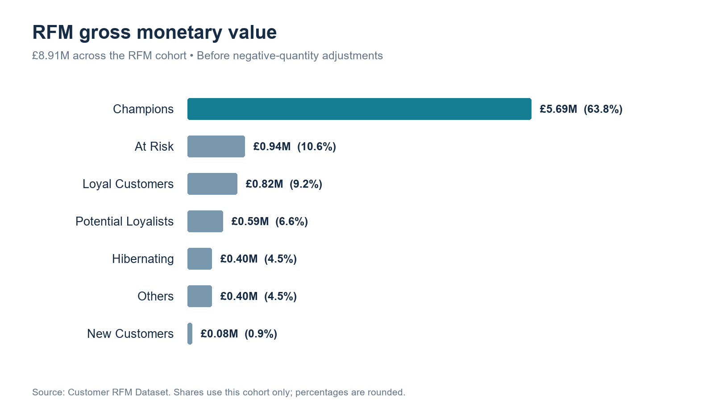

# Online Retail Customer Analytics & RFM Segmentation

## Project Overview

This project examines sales patterns and customer purchasing behavior for an online retailer. I built the first phase in Excel to connect transaction-level records with monthly sales analysis and an interpretable RFM segmentation.

The main finding is concentration: **911 Champions represent 21.0% of purchasing customers with known IDs and account for 63.8% of that cohort's gross monetary value.** The largest segment by customer count, Hibernating, contributes only 4.5%. These differences provide a starting point for deciding where retention and reactivation tests might be useful.

**Phase 1 is complete:** Excel, Power Pivot, DAX, PivotTables, and PivotCharts. Python analysis, statistical testing, and K-Means clustering are planned for Phase 2.

[Download the analysis workbook](excel/Online_Retail_Portfolio_English.xlsx). Start with `Executive Summary`, then follow the supporting sales and customer worksheets.

## Business Questions

- How does gross revenue change across months, and how much comes from the UK?
- What does the monthly customer mix suggest about repeat purchasing?
- How concentrated is customer spending across RFM segments?
- Which groups warrant retention, repeat-purchase, or reactivation experiments?

## Dataset

The project uses the [UCI Online Retail dataset](https://archive.ics.uci.edu/dataset/352/online%2Bretail), covering a UK-based online retailer that sells gifts and serves both individual buyers and wholesalers. All results below use the final `Online_Retail_Portfolio_English.xlsx` workbook.

| Coverage | Value |
| --- | ---: |
| Observation period | 1 December 2010–9 December 2011 |
| Transaction rows | 541,909 |
| Distinct invoice IDs, including cancellations | 25,900 |
| Distinct known customer IDs | 4,372 |
| Customers included in RFM | 4,339 |
| Rows missing CustomerID | 135,080 (24.9%) |

Each row is an invoice line, not a separate order. The original fields include invoice number, product code and description, quantity, invoice date, unit price, customer ID, and country. Monetary amounts are **GBP (£)**; no currency conversion is applied.

Dataset credit: Chen, D. (2015). *Online Retail*. UCI Machine Learning Repository. [DOI: 10.24432/C5BW33](https://doi.org/10.24432/C5BW33). The source dataset is licensed under [CC BY 4.0](https://creativecommons.org/licenses/by/4.0/).

## Tools

| Tool | Role in Phase 1 |
| --- | --- |
| Excel formulas | Transaction flags, revenue fields, RFM scores, and segment rules |
| Power Pivot and DAX | Data Model measures supporting invoice and customer analysis |
| PivotTables | Monthly, geographic, and customer-level summaries |
| PivotCharts | Revenue trends, market comparisons, customer mix, and segment distributions |

## Data Preparation

The workbook retains the transaction records and adds fields for analysis:

- **Transaction Type:** invoice numbers beginning with `C` are flagged as cancellations.
- **Customer ID status:** missing IDs are identified explicitly. These rows remain in sales totals but cannot be assigned to an RFM customer.
- **Market:** United Kingdom is grouped as UK; other countries are grouped as International.
- **Revenue:** `Quantity × UnitPrice` when quantity is positive, otherwise zero.
- **Cancellation:** `Quantity × UnitPrice` when quantity is negative, otherwise zero.

Gross revenue sums the Revenue field. Net revenue adds the negative-quantity amounts. The invoice-prefix flag and quantity-based calculation are separate rules: the Cancellation field includes negative-quantity adjustments, not only invoices beginning with `C`.

The RFM dataset contains known customers with at least one positive-quantity purchase. This leaves 4,339 customers; the other 33 known IDs have no qualifying purchase. Their records remain in the source worksheet.

## Analysis / Methodology

Sales analysis aggregates gross revenue by month and market, with a separate view of the ten largest international markets. Customer analysis uses the saved monthly New Customers and Returning Customers measures, followed by customer-level recency, frequency, and monetary value.

### Revenue and invoice definitions

| Metric | Final workbook result |
| --- | ---: |
| Gross revenue | £10,644,560.42 |
| Negative-quantity amount | −£896,812.49 |
| Net revenue | £9,747,747.93 |
| UK gross revenue | £9,003,097.96 |
| UK share of gross revenue | 84.6% |
| Gross monetary value of the RFM cohort | £8,911,407.90 |

The `distinct invoice no` worksheet counts **all 25,900 invoice IDs**, including cancellations. Its £410.99 ratio is gross revenue per invoice ID. An independent count gives 22,064 invoice IDs without the cancellation prefix, corresponding to £482.44 in gross revenue per such ID. These definitions should be reconciled before presenting a conventional average order value or sales-order growth metric.

For verification, the transaction rows were re-aggregated and the RFM records checked against the source. Gross and net revenue reconcile to the saved summaries. All 4,339 customer monetary totals, purchase invoice counts, and segment assignments match the underlying records and rules.

## Key Findings

**Revenue reached its highest monthly level in November 2011.** Gross revenue rose from £1.06M in September to £1.15M in October and £1.51M in November. November was 30.7% above October. December 2011 contains only 1–9 December, so its lower total is not evidence of a full-month decline.

**The business depended heavily on the UK.** The UK contributed 84.6% of gross revenue. The Netherlands (£285,446) and EIRE (£283,454) led the international market ranking, followed by Germany and France.

**The saved customer mix shifted toward returning customers in November.** Returning Customers increased from 1,067 in October to 1,387 in November, while New Customers decreased from 358 to 324. This accompanies the revenue increase, but the chart alone does not establish how much revenue growth came from repeat purchasing.

**Customer count and monetary contribution tell different stories.** Champions generated £5.69M of the RFM cohort's £8.91M gross monetary value. Hibernating customers were more numerous but generated £0.40M. At Risk customers contributed £0.94M historically, making them a more promising starting point for targeted reactivation tests than a blanket campaign to every inactive customer.








## RFM Segmentation

RFM summarizes three aspects of purchasing behavior:

- **Recency:** days since the most recent positive-quantity purchase, measured as of **10 December 2011**.
- **Frequency:** distinct purchase invoice IDs per customer within the observation window.
- **Monetary:** gross value of positive-quantity purchases per customer, before negative-quantity adjustments.

Each dimension receives a score from 1 to 5. Lower recency receives a higher score; higher frequency and monetary value receive higher scores. The workbook uses these fixed boundaries:

| Dimension | Ascending boundaries |
| --- | --- |
| Recency, days | 14.2, 33, 72, 180 |
| Frequency, invoices | 1, 2, 3, 6 |
| Monetary, GBP | 250.106, 489.724, 941.942, 2,057.914 |

Each boundary is inclusive on its lower-value band. Recency bands receive scores 5 to 1; frequency and monetary bands receive scores 1 to 5. Tied values mean the resulting groups need not contain equal numbers of customers. The three-digit RFM code is `100 × R + 10 × F + M`, preserving the separate dimensions.

The following rules are evaluated **in order**, with the first match assigning the segment. Here, R, F, and M mean scores, not raw values.

| Priority | Segment | Rule |
| ---: | --- | --- |
| 1 | Champions | R ≥ 4, F ≥ 4, M ≥ 4 |
| 2 | At Risk | R ≤ 2 and either F ≥ 3 or M ≥ 4 |
| 3 | Loyal Customers | F ≥ 4 and M ≥ 3 |
| 4 | Potential Loyalists | R ≥ 4 and F = 2–3 |
| 5 | New Customers | R ≥ 4 and F = 1 |
| 6 | Hibernating | R ≤ 2, F ≤ 2, M ≤ 3 |
| 7 | Others | All remaining combinations |

Placing At Risk before Loyal Customers ensures that a historically frequent buyer with a long gap since their last purchase is treated as At Risk.

### Segment results

| Segment | Customers | Customer share | Avg. recency, days | Avg. frequency | Gross monetary value | Value share |
| --- | ---: | ---: | ---: | ---: | ---: | ---: |
| Champions | 911 | 21.0% | 12.9 | 11.50 | £5,688,406 | 63.8% |
| At Risk | 512 | 11.8% | 145.5 | 3.70 | £942,428 | 10.6% |
| Loyal Customers | 364 | 8.4% | 40.2 | 5.86 | £820,418 | 9.2% |
| Potential Loyalists | 484 | 11.2% | 16.9 | 2.42 | £586,237 | 6.6% |
| Hibernating | 1,215 | 28.0% | 212.5 | 1.25 | £400,196 | 4.5% |
| Others | 616 | 14.2% | 51.9 | 1.79 | £396,825 | 4.5% |
| New Customers | 237 | 5.5% | 19.4 | 1.00 | £76,898 | 0.9% |
| **Total** | **4,339** | **100%** | | | **£8,911,408** | **100%** |

Shares use the RFM cohort as the denominator, not all sales or all known IDs. Displayed percentages may not sum to 100% because of rounding. The RFM label New Customers means a recent, single-purchase customer in this observation window; it is separate from the monthly chart's New Customers measure.






## Business Implications

- **Prioritize Champion retention.** Monitor changes in purchase frequency and test relevant service or replenishment reminders. Their spending concentration makes this group worth understanding before offering broad discounts.
- **Test selective reactivation for At Risk customers.** Use prior value and purchase history to prioritize outreach, then compare incremental purchases with a holdout group.
- **Encourage another purchase from recent buyers.** Test follow-up timing for New Customers and Potential Loyalists rather than assuming one offer fits both groups.
- **Limit spending on broad Hibernating campaigns.** Start with a small, low-cost experiment and measure response before expanding.

These are hypotheses for testing. Phase 1 does not estimate campaign lift, profitability, or customer lifetime value.

## Limitations

- **Missing customer IDs:** 24.9% of transaction rows cannot enter customer segmentation. Identifiable customers may not represent all buyers.
- **Gross spending is not retained revenue:** RFM monetary value does not subtract returns or cancellations. Large purchases later reversed can still influence a customer's segment.
- **Saved measure definitions:** the invoice analysis includes cancellations. The monthly mix also reports returning customers in the first observed month, so its labels should not be treated as a validated acquisition cohort or retention rate without reviewing the DAX and filter logic.
- **Limited observation window:** roughly one year cannot establish recurring seasonality, true customer acquisition dates, or permanent churn. December 2011 is incomplete.
- **Rules and unusual transactions:** fixed RFM thresholds and rule precedence affect membership. The quantity-based revenue definition does not separately exclude zero or negative prices, and the report does not assume duplicate or unusual records have been removed. These choices need sensitivity checks.
- **Descriptive scope:** segment differences and monthly trends show associations. They do not establish causes or predict future customer behavior.

## Next Steps / Phase 2

1. Reproduce the workbook's totals and customer features in Python, documenting cancellation handling, duplicate records, missing IDs, and unusual prices or quantities.
2. Examine RFM distributions and test how return-adjusted monetary value, outliers, and alternative score boundaries change the results.
3. Use statistical analysis and uncertainty estimates to compare customer behavior, with clearly defined populations and observation windows.
4. Fit K-Means after evaluating feature transformations and scaling. Compare cluster separation, stability, and interpretability across candidate values of K.
5. Compare those clusters with the rule-based segments and evaluate whether they add useful distinctions for business decisions.

These steps are planned work, not completed results.

## Repository Structure

```text
online-retail-customer-analytics/
├── README.md
├── excel/
│   └── Online_Retail_Portfolio_English.xlsx
└── images/                              # Report charts
    ├── monthly_revenue.png
    ├── uk_international_revenue.png
    ├── customer_mix.png
    ├── rfm_customer_distribution.png
    └── rfm_monetary_distribution.png
```

The workbook contains the charts and underlying analysis. The PNG figures reproduce the corresponding workbook chart data with consistent formatting. Phase 2 notebooks and processed datasets will be added when that work is complete.
